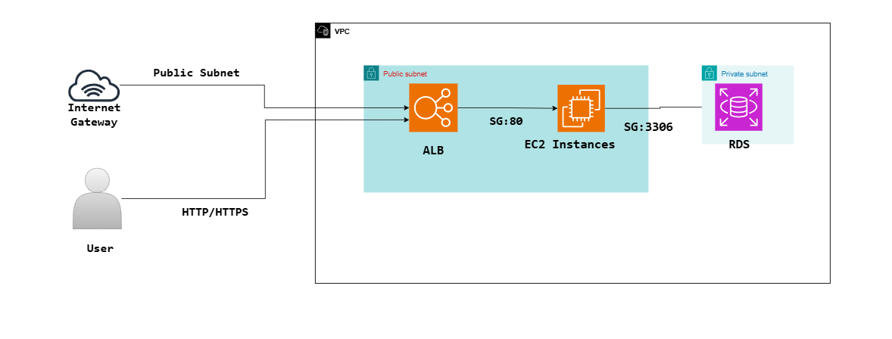

# 🌍 Terraform × AWS Infrastructure Portfolio

こんにちは、クラウドエンジニア志望の **室木 海里（Kairi Muroki）** です。  
このリポジトリは、Terraform を用いた AWS インフラ構成のポートフォリオです。

---

## 🚀 構築目的

- AWS × Terraform の実践力を証明
- モジュール分離・依存管理・state制御を含む構成力のアピール
- GitHubを通じて構成と考え方を公開・発信

---

## 🛠 使用技術・ツール

| カテゴリ | 内容 |
|----------|------|
| **IaC** | Terraform v1.7（`lifecycle`, `depends_on`, `import` 等） |
| **クラウド** | AWS（VPC / EC2 / S3 / RDS / CloudWatch） |
| **OS** | Linux（Ubuntu） |
| **言語** | HCL / Bash / Python（基本） |
| **資格** | AWS SAP / 基本情報 / LPIC-1 |

---

## 📁 ディレクトリ構成（例）

├── main.tf
├── variables.tf
├── outputs.tf
├── modules/
│ ├── ec2/
│ ├── s3/
│ └── iam/
├── userdata.sh
├── tf_graph.dot / .png
├── terraform.tfvars
└── README.md

> ※ `architecture.png` は現在作成中です